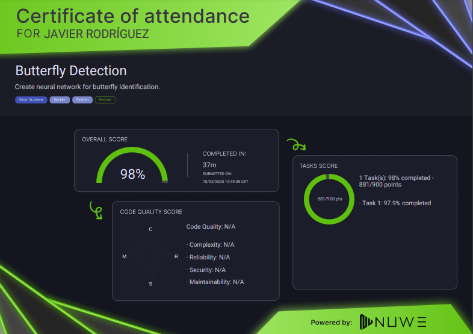

# 🦋 Butterfly Detection  📸

Category   ➡️   Data Science

Subcategory   ➡️   Computer Vision Engineer

Difficulty   ➡️   Medium

Expected solution time ➡️ 4 hours. **It is essential to complete your solution within this timeframe,** as it is a critical performance indicator used by the hiring company to evaluate your work. The timer will begin when you click the start button and will stop upon your submission.

---

## 🌐 Background

In the heart of a lush forest, biologists are on a mission to unravel the mysteries of butterfly species. Cameras set up throughout the forest capture thousands of images, creating a need for a technological solution to identify butterflies within these photos efficiently.

As a data scientist, your expertise is crucial for developing a solution that automates the process of detecting and identifying butterflies, aiding the biologists in their study.


### 🗂️ Dataset 

You will be provided with a dataset comprising images taken from the forest, with various scenes including different animals, plants, and insects. Some images will contain butterflies, while others will not.

#### Download Links:
- For the training dataset: [Download train.zip](https://cdn.nuwe.io/joboffers-data/dl2/train.zip)
- For the testing dataset: [Download test.zip](https://cdn.nuwe.io/joboffers-data/dl2/test.zip)

### 📊 Data Processing

Data preprocessing should be applied to normalize and prepare the images for the model, considering the various lighting conditions and angles present in the dataset.

### 🤖 Model

Select and train a neural network capable of distinguishing butterflies from other elements in the images. You may experiment with different architectures, like convolutional neural networks (CNNs), to find the most effective solution.

## 📂 Repository Structure

The repository structure is provided and must be adhered to strictly:

```
nuwe-data-dl2/
├── data
│   └── labels_path.csv
├── model.py
├── predictions
│   ├── example_predictions.json
│   └── predictions.json
├── README.md
└── requirements.txt

```

The `predictions` folder will contain the `predictions.json` file with your model's predictions on whether an image contains a butterfly or not.

## 🎯 Tasks

- Task 1: Your task is to create a neural network model able to process images from forest cameras and accurately detect the presence of butterflies. This model must differentiate butterflies from other insects, adapting to various lighting conditions and angles.


## 📤 Submission

Submit a `predictions.json` file containing the model's predictions for each image. The file should be correctly formatted, with the image file identifier as the key and the predicted presence of a butterfly as the value.
`predictions.json`:
```json
{
    "target": {
        "imagen_1.jpg": 0,
        "imagen_2.jpg": 1,
        "imagen_3.jpg": 1,
        ...
    }
}
```

## 📊 Evaluation

Performance will be measured using accuracy and F1 Score to ensure precision and recall, offering a balanced view of the model's ability to detect butterflies.
- Task 1: 900 points

**⚠️ Please note:**  
All submissions will undergo a manual code review process to ensure that the work has been conducted honestly and adheres to the highest standards of academic integrity. Any form of dishonesty or misconduct will be addressed seriously, and may lead to disqualification from the challenge.
The file to be evaluated will be **predictions.json**. This file must be inside **/predictions**.

## ❓ FAQs

**Q1: What is the goal of the Butterfly Detection Challenge?**  
A1: To develop a model that can automatically detect the presence of butterflies in images from forest cameras.

**Q2: What type of data will I work with?**  
A2: You will work with a dataset of images that includes various forest scenes, some with butterflies and some without.

**Q3: Which neural network architectures are recommended?**  
A3: CNNs are typically recommended for image detection tasks, but you are encouraged to explore and select the architecture that yields the best results.

**Q4: How will the model's performance be evaluated?**  
A4: The model's performance will be evaluated based on its accuracy and F1 Score, which consider both precision and recall.
