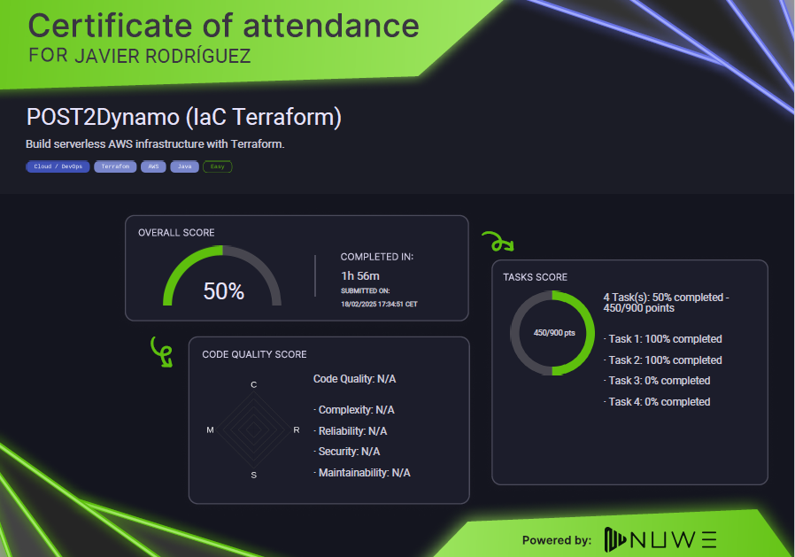

🚀 Desafío POST2Dynamo: Infraestructura Serverless con AWS y Terraform 🌍
Recientemente, participé en un desafío técnico que combinaba AWS, DevOps y Infraestructura como Código (IaC). El reto: automatizar la inserción de datos en DynamoDB mediante una API sin servidor, gestionada con Terraform y desplegada en LocalStack. 💡

🔹 Tecnologías Clave
🛠 AWS Lambda → Función sin servidor que procesa las solicitudes y las guarda en la base de datos.
📡 API Gateway → Exposición del endpoint /eventos para interactuar con la Lambda.
📊 DynamoDB → Base de datos NoSQL para almacenar los eventos.
📦 Terraform → Herramienta de IaC para definir y desplegar la infraestructura de manera automatizada.
🛠 LocalStack → Simulación local de AWS para desarrollo y pruebas sin necesidad de una cuenta en la nube.

🏆 El Desafío
Consistía en construir una infraestructura completamente serverless, donde una solicitud POST a un endpoint creara automáticamente un registro en DynamoDB. Todo esto debía definirse con Terraform y ejecutarse en LocalStack.

📂 Archivos Clave
📜 main.tf → Define la infraestructura (Lambda, API Gateway y DynamoDB).
🐍 lambdaname.py → Contiene la lógica de la función Lambda en Python.
📦 lambdaname.zip → Archivo comprimido con la implementación de la Lambda para su despliegue.
🔑 policy.json → Configuración de permisos para que los servicios interactúen correctamente.

🚀 Proceso de Solución
1️⃣ Definir la infraestructura en main.tf con los recursos necesarios.
2️⃣ Desarrollar la función Lambda para procesar los eventos y almacenarlos en DynamoDB.
3️⃣ Configurar API Gateway para recibir solicitudes POST.
4️⃣ Desplegar con Terraform (terraform apply).
5️⃣ Probar la API enviando solicitudes POST y validando los datos en LocalStack.

🔥 Mi Experiencia Personal
Cuando leí el enunciado por primera vez, me pareció más complicado de lo que realmente era. Entender la magnitud del problema y cómo conectar cada pieza no fue tarea fácil. Sin embargo, con paciencia y enfoque, poco a poco fui avanzando. 💡

Lo más importante en este tipo de retos es no frustrarse y dividir el problema en partes más pequeñas. Una vez que logré visualizar cada componente (Lambda, API Gateway, DynamoDB y Terraform), todo empezó a encajar.

Para quienes quieran aprender más, dejaré los archivos necesarios para la solución del problema en mi GitHub. 🔗📂

🚀 Escalabilidad y Aplicaciones
Este tipo de arquitectura serverless permite:
✅ Reducción de costos (se paga solo por uso).
✅ Escalabilidad automática sin gestionar servidores.
✅ Rápido despliegue con Terraform.
✅ Mayor eficiencia en flujos de trabajo con AWS y DevOps.

Este reto me permitió fortalecer mis habilidades en Cloud Computing, DevOps y Serverless, ¡y ahora voy por más desafíos! 🚀

🔹 ¿Has trabajado con Terraform y AWS Lambda? ¿Cómo ha sido tu experiencia? ¡Déjamelo en los comentarios! 👇🔥



# NUWE Cloud AWS Challenge - ALD

### Category   ➡️   Cloud AWS

### Subcategory   ➡️   IaC Terraform

### Difficulty   ➡️   (Basic)

## 🌐 Background

Some processes that are done in different environments, can consume too much time of a person doing a job that could be automated. An example of this is automatically inserting data into a NoSQL database such as DynamoDB.  

The goal of this challenge will be to develop a fully automated infrastructure that, through a simple POST Request to an endpoint, automatically inserts data into DynamoDB. All this app must be **serverless**, and developed using **Terraform** as IaC.

## ❓ Guides

- Resources to be deployed: **API Gateway**, **Lambda**, **DynamoDB**. Everything must have the necessary resources to function correctly.

- The correction of this challenge will be done in an automated way, so meeting the objectives is crucial. To this end, some naming guidelines will be given so that the correct functioning of the infrastructure can be tested:
    - Name of the table: **EVENTS**
        - Fields the table must have: **eventId** and **category**. 
    - Name of the lambda function: **CreateEventHandler**. This will automatically execute when a request is sent to the API endpoint and inserts the data into DynamoDB.
        - How the lambda function works:
            - Triggered when a valid POST request is made to the API endpoint.
            - If the request is valid, it returns: 'body': '{"status":"Event created"}' and inserts the data into DynamoDB table.
            - If not valid, it returns: '{"status":"Server Error."}'
    - Endpoint name: **/events**
    - API name: **product-nuwe**
    - API Stage: **production** 

- Development environment: Localstack. In order for the correction to be carried out, it will be necessary to develop everything for localstack, since it does not require personal keys of any kind. Some data to take into account:
    - Region: us-east-1
    - access_key: test
    - secret_key: test

- **Additional information: It is important to respect the guidelines that have been provided, as the automatic correction tests the correct performance of the infrastructure, dividing this functioning into objectives from the simplest to the most complex.**

## 🎯 Objectives

1. The main.tf file is working and ready for `apply`.
2. Deploy all proposed resources.
3. API works properly.
4. Lambda works properly.

## 📂 Repository Structure
```bash
nuwe-cloud-ald/
├── README.md
└── ServerlessApp
    ├── lambda
    │   ├── lambdaname.py
    │   └── lambda.zip
    └── Terraform
        ├── main.tf
        ├── policy.json
        └── Other files required by main.tf
```
**The structure predefined in the challenge must always be followed for the automatic correction to work correctly. This structure and the names may vary, but it will always follow a standard that cannot be modified by the participant.**

### Modifiable files
- lambdaname.py: contains the logic of the lambda function in Python.
- main.tf: contains the logic of the infrastructure to be developed by the participant.
- policy.json(only if needed): file necessary for the correct functioning of the logic applied in main.tf. 
- Other files: the files that are necessary/required by main.tf for the infrastructure to work properly can be added.

### Additional information
- The lambda function must be written in python.

## 📊 Evaluation
The final score will be given on the basis of whether or not the objectives have been met.

In this case, the challenge will be evaluated on 900 points which are distributed as follows:

- Objective 1: 225 points
- Objective 2: 225 points
- Objective 3: 225 points
- Objective 4: 225 points

### 📤 Submission

1. Solve the proposed objectives.
2. Push the changes you have made.
3. Click on Submit Challenge.
4. Wait for the results.

